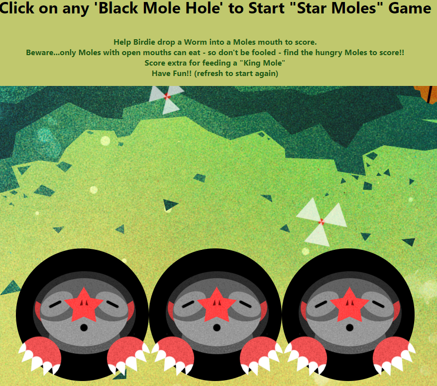

Some game fun with "Star Moles" game
--
A take on wack-a-mole style game. 
This is a desktop style game.
---
- Made with vanilla Javascript, CSS for styling and HTML.
- Part of a Bootcamp project with Brian Holt from Frontend Masters.

- Help Birdie (which is your game cursor) drop a Worm into a Moles mouth to score.
-    Beware...only Moles with open mouths can eat - so don't be fooled - find the hungry Moles to score!!
-    Score extra for feeding a "King Mole"
-    Have Fun!! (refresh to start again)

- Using javascript functions such as
* interval and math functions.
* status queries where parent/child selectors play a vital role.
* animation frames.

